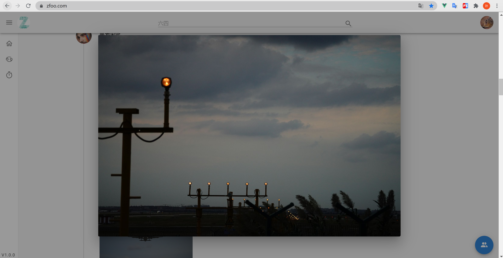
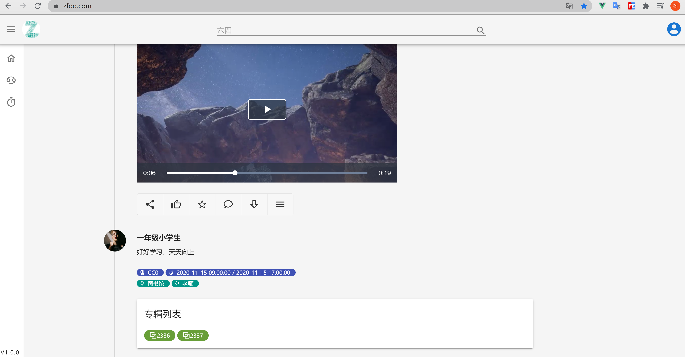
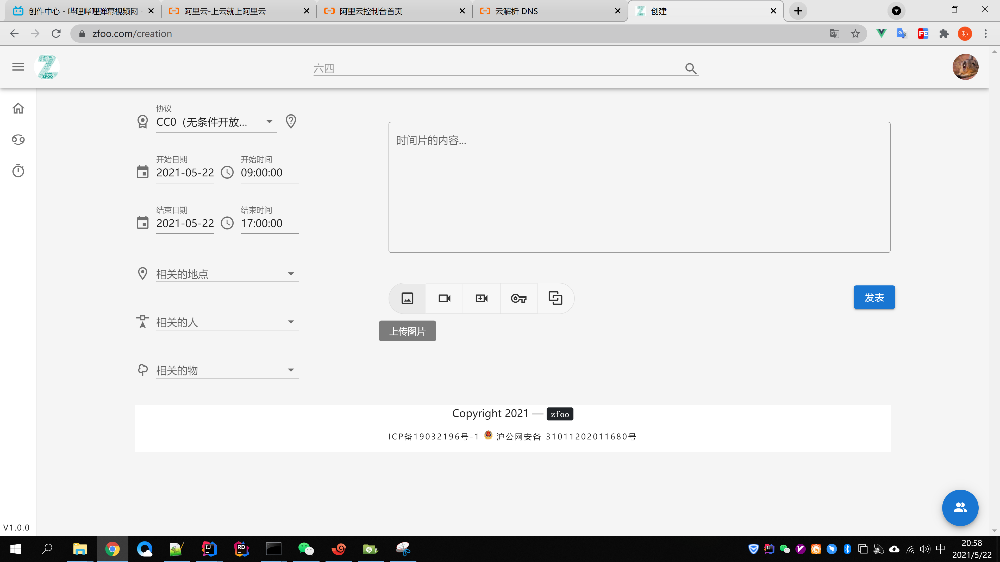
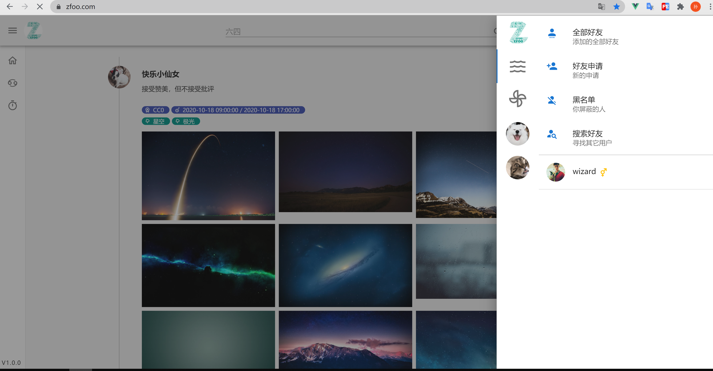
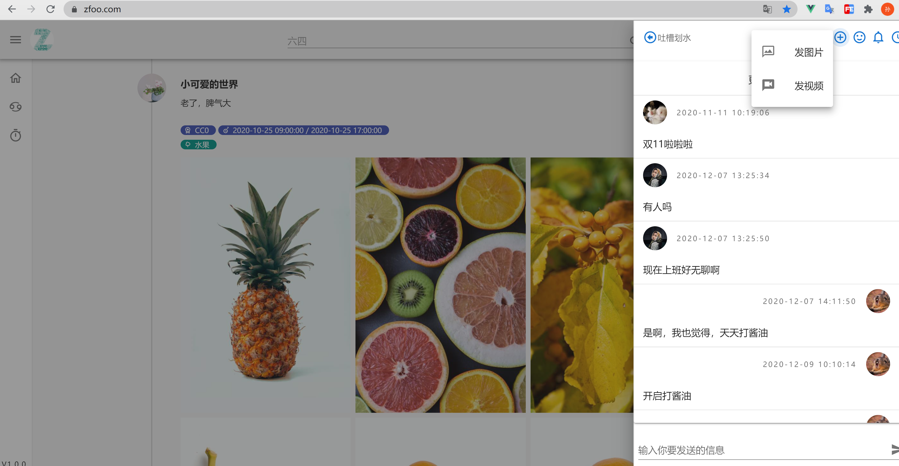

### Ⅰ. zapp简介

- **本项目已经停止维护，项目里使用的zfoo老版本zfoo-zapp分支**，本项目已经集成zfoo-zapp分支
- 之前做了一个资源图片分享和交友网站，由于不可抗因数倒闭了。
- 一怒之下就把前后端的代码都开源出来，顺便把数据库也开源了，开源开到裤衩。

### Ⅱ. 功能技术介绍

后端：

- 微信登录，微信公众号登录，微博登录，手机号码登录
- 全站https
- 手机短信验证
- 百度谷歌SEO，使用vue无需任何配置即可实现单页面的SEO，原理是使用puppeteer在服务端渲染页面
- 百度SEO主动推送
- 发图片，发视频，把大文件上传到oss上
- 聊天发图片，发视频，频道聊天，好友聊天，通过websocket实现
- spring boot
- zfoo rpc
- mongodb 4.2
- zookeeper 3.6.1

前端：

- [前端原代码](./web)
- PWA，自适应页面
- service worker实现
- vue, vuetify
- 百度和google页面统计

数据库和资源：

```
链接：https://pan.baidu.com/s/1pX0T-Ok_2Su-dz_9ghvfeg 
提取码：zfoo 
```

[B站视频介绍及运行教程](https://www.bilibili.com/video/BV1Y44y1z7zf?share_source=copy_web)

### Ⅲ. 适用项目

- 你可以轻易把这个项目改造成一个聊天室，博客，交友平台，具有高度的自定义
- 高度企业化的项目，本项目就是一个完整的企业开源项目

### Ⅳ. 功能截图

- 图片浏览
  

- 大图预览
  

- 图片下载
  

- 视频播放
  

- 分享收藏和点赞
  

- 个人中心，资料，图片小圈子
  

- 分享图片和视频
  

- 好友聊天
  

- 群组聊天
  

- 频道聊天
  

- 聊天发视频发图片
  

- 登录/登出
  

### Ⅴ. 项目部署

- 将前端项目zapp-web打包，打包过后，放在后端项目zapp-web下的resources中的static目录
- 再将zapp用maven打包install成fatjar，所以每个项目只有一个jar包
- 最后使用命令直接运行，nohup java -Dspring.profiles.active=pro -jar ${jarPath} >/dev/null 2>&1 &
- -Dspring.profiles.active这个参数决定了用哪一个配置文件，pro代表使用 deploy-pro.properties 这个配置文件
