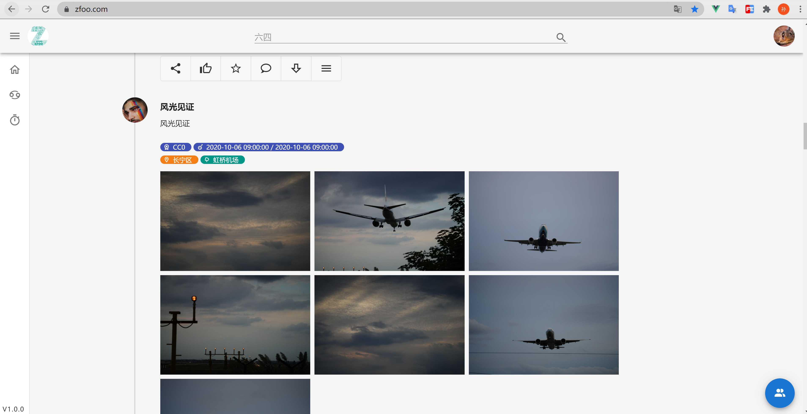
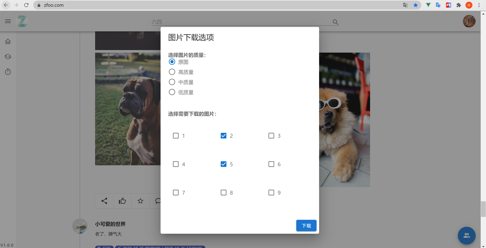
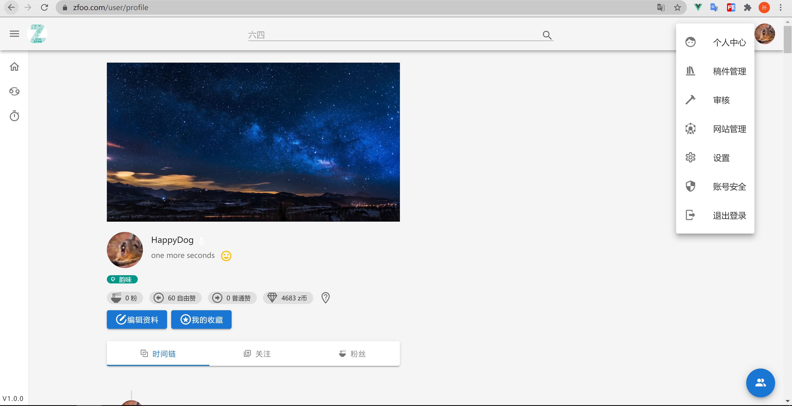
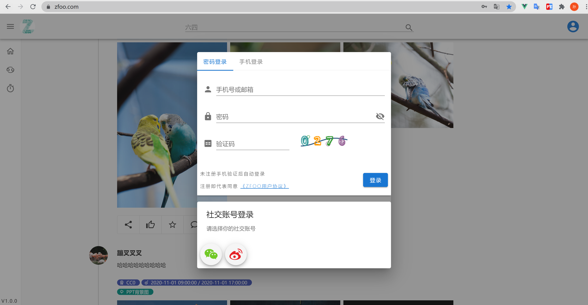

# 一、项目简介

## 1.项目的整体设计
- 设计的原则是，视图和数据分离。简单的说就是在view下尽量写页面交互逻辑，在store下尽量写数据处理逻辑。
- api，前端和服务器的交互接口
- asset，存放资源文件
- component，不同view公用的组件
- i18n，多语言国际化
- mock，模拟请求，因为现在都是直接开启服务器联调的，所以一般用不到这个
- plugin，使用的插件
- router，页面的路由
- store，页面的数据存储和交互
- view，页面


## 2.项目概括
- zfoo是原来的网站被GFW后的前端项目，前后端分离

- PWA，自适应页面
- service worker实现
- 百度和google页面统计
- websocket实现聊天和群组频道聊天
- axios实现普通http请求
- SEO使用puppeteer在服务端渲染页面
- vue
- vue-meta，动态设置router标签
- [vuetify](https://vuetifyjs.com/en/) 基础ui库
- lodash
- js-cookie


## 3.部署
1. 打包过后，放在后端的spring boot中的static目录，使用spring boot当作静态资源服务器
  
2. 或者将打包后的资源放在oss或者cdn上两者皆可

```
如果要使用service-worker需要将index.html中的下面链接替换，不使用请忽略
https://static.zfoo.com/manifest.json
https://www.zfoo.com/manifest.json
```


# 二、编码规范

## 1.编码规约

### 1.1.代码格式
- 使用eslinttrc.js的编码规范

### 1.2.提交规范
- 代码提交之前需要执行npm脚本的lint格式化代码，代码提交的时候需要固定格式如下：
```
feat[module]: xxx，新增某一项功能
perf[module]: xxx，优化了模块代码或者优化了什么功能
fix[module]: xxx，修改了什么bug
test[module]: xxx，测试了什么东西
doc[module]: xxx，增加了什么文档
del[module]: xxx，删除了某些功能或者无用代码
```

### 1.3.node和npm的安装
- 因为node已经集成了npm，所以只要安装node就可以n
```
npm版本必须大于6，查看npm是否安装成功：npm --version
nodejs的版本必须大于10，查看nodejs是否安装成功：node --version
```

- npm安装报错处理，大部分重装就可以解决
```
npm cache clean --force

删除node_module包

删除 C:\Users\Administrator\AppData\Roaming 路径下的 npm和npm-cache2个文件夹

然后再重新执行npm install

如果一只安装不成功只能使用淘宝的镜像，不过不推荐，可参考：https://blog.csdn.net/qq_38225558/article/details/86485843
```


## 2.工程规约

### 2.1使用到的技术

- vue，基础js框架，https://cn.vuejs.org/v2/guide/
- vue-i18n，国际化多语言
- vue-router，界面路由
- vuex，数据存储和交互
- vuex-router-sync，使vue-router和vuex结合，https://blog.csdn.net/vv_bug/article/details/84064708


### Ⅳ. 功能截图

- 图片浏览
  

- 大图预览
  

- 图片下载
  

- 视频播放
  

- 分享收藏和点赞
  

- 个人中心，资料，图片小圈子
  

- 分享图片和视频
  

- 好友聊天
  

- 群组聊天
  

- 频道聊天
  

- 聊天发视频发图片
  

- 登录/登出
  